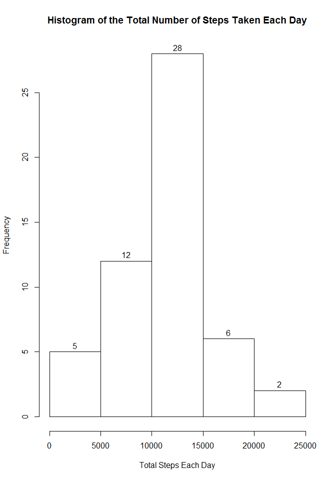

# Reproducible Research: Peer Assessment 1


## Loading and preprocessing the data


```r
library(dplyr)
```

```
## 
## Attaching package: 'dplyr'
## 
## The following object is masked from 'package:stats':
## 
##     filter
## 
## The following objects are masked from 'package:base':
## 
##     intersect, setdiff, setequal, union
```

```r
library(lattice)

if(!file.exists("activity.csv"))
{
     message("Downloading the file")
     fileUrl <- "https://d396qusza40orc.cloudfront.net/repdata%2Fdata%2Factivity.zip"
     download.file(fileUrl, destfile = "./activity.zip")
     unzip("./activity.zip")    
}

activity <- read.csv("activity.csv", na.strings="NA")
activity$date <- as.Date(activity$date)
```

## What is mean total number of steps taken per day?


```r
stepsPerDay <- summarize(group_by(activity, date), total.steps = as.numeric(sum(steps)))
hist(stepsPerDay$total.steps, xlab="Total Steps Each Day", main="Histogram of the Total Number of Steps Taken Each Day", labels=TRUE)
```

 

```r
mean(stepsPerDay$total.steps, na.rm=TRUE)
```

```
## [1] 10766.19
```

```r
median(stepsPerDay$total.steps, na.rm=TRUE)
```

```
## [1] 10765
```


## What is the average daily activity pattern?


```r
avgStepsPerInterval <- summarize(group_by(activity, interval), average.steps = mean(steps, na.rm = TRUE))
plot(x=avgStepsPerInterval$interval, y=avgStepsPerInterval$average.steps, type="l", xlab="Interval", ylab="Average Steps", main="Average Number of Steps Taken Across All Days")
```

 

```r
avgStepsPerInterval[which.max(avgStepsPerInterval$average.steps),1]
```

```
## Source: local data frame [1 x 1]
## 
##   interval
## 1      835
```


## Inputing missing values


```r
cleanActivity <- activity
nrow(cleanActivity[is.na(cleanActivity$steps),])
```

```
## [1] 2304
```

```r
cleanActivity[is.na(cleanActivity),1] <- 0

dates <- group_by(cleanActivity, date)
stepsPerDay <- summarize(dates, total.steps = as.numeric(sum(steps)))
hist(stepsPerDay$total.steps, xlab="Total Steps Each Day", main="Histogram of the Total Number of Steps Taken Each Day", labels=TRUE)
```

 

```r
mean(stepsPerDay$total.steps, na.rm=TRUE)
```

```
## [1] 9354.23
```

```r
median(stepsPerDay$total.steps, na.rm=TRUE)
```

```
## [1] 10395
```
##### There is almost no diferent in mean and median total number of steps taken per day after the missing Steps values are replaced with the average number of steps at the same interval.

## Are there differences in activity patterns between weekdays and weekends?


```r
dayActivity <- cleanActivity
dayActivity <- mutate(cleanActivity, Days = weekdays(dayActivity$date))
dayActivity$Days <- ifelse(dayActivity$Days %in% c("Saturday","Sunday"), "weekend", "weekday")

avgStepsPerIntervalPerWeekday <- summarize(group_by(dayActivity, interval, Days), average.steps = mean(steps))
p <- xyplot(average.steps ~ interval | Days, data=avgStepsPerIntervalPerWeekday, layout=c(1,2), type="l")
print(p)
```

 
